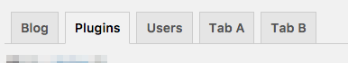

# WP Admin Tabs

[](https://packagist.org/packages/typisttech/wp-admin-tabs)
[](https://packagist.org/packages/typisttech/wp-admin-tabs)
[](https://travis-ci.org/TypistTech/wp-admin-tabs)
[](https://codecov.io/gh/TypistTech/wp-admin-tabs)
[](https://scrutinizer-ci.com/g/TypistTech/wp-admin-tabs/?branch=master)
[](https://travis-ci.org/TypistTech/wp-admin-tabs)
[](https://styleci.io/repos/107187828)
[](https://gemnasium.com/github.com/TypistTech/wp-admin-tabs)
[](https://packagist.org/packages/typisttech/wp-admin-tabs)
[](https://www.typist.tech/donate/wp-admin-tabs/)
[](https://www.typist.tech/contact/)

Create tabbed navigation for WordPress admin dashboard, the OOP way.

<!-- START doctoc generated TOC please keep comment here to allow auto update -->
<!-- DON'T EDIT THIS SECTION, INSTEAD RE-RUN doctoc TO UPDATE -->


- [Install](#install)
- [Usage](#usage)
  - [Example](#example)
  - [AdminTab](#admintab)
    - [`__construct(string $menuTitle, string $url)`](#__constructstring-menutitle-string-url)
  - [AdminTabCollection](#admintabcollection)
    - [`add(AdminTab ...$adminTabs)`](#addadmintab-admintabs)
    - [`render()`](#render)
    - [`toHtml(): string`](#tohtml-string)
- [Frequently Asked Questions](#frequently-asked-questions)
  - [Is this a plugin?](#is-this-a-plugin)
  - [What to do when wp.org plugin team tell me to clean up the `vendor` folder?](#what-to-do-when-wporg-plugin-team-tell-me-to-clean-up-the-vendor-folder)
  - [Can two different plugins use this package at the same time?](#can-two-different-plugins-use-this-package-at-the-same-time)
  - [Do you have real life examples that use this package?](#do-you-have-real-life-examples-that-use-this-package)
- [Support!](#support)
  - [Donate via PayPal *](#donate-via-paypal-)
  - [Donate Monero](#donate-monero)
  - [Mine me some Monero](#mine-me-some-monero)
  - [Why don't you hire me?](#why-dont-you-hire-me)
  - [Want to help in other way? Want to be a sponsor?](#want-to-help-in-other-way-want-to-be-a-sponsor)
- [Developing](#developing)
- [Running the Tests](#running-the-tests)
- [Feedback](#feedback)
- [Change log](#change-log)
- [Security](#security)
- [Contributing](#contributing)
- [Credits](#credits)
- [License](#license)

<!-- END doctoc generated TOC please keep comment here to allow auto update -->

## Install

Installation should be done via composer, details of how to install composer can be found at [https://getcomposer.org/](https://getcomposer.org/).

``` bash
$ composer require typisttech/wp-admin-tabs
```

You should put all `WP Admin Tabs` classes under your own namespace to avoid class name conflicts.

- [imposter-plugin](https://github.com/Typisttech/imposter-plugin)
- [mozart](https://github.com/coenjacobs/mozart)

## Usage

### Example



```php
$adminTabCollection = new AdminTabCollection();
$adminTabCollection->add(
    new AdminTab('Blog', 'https://www.typist.tech'),
    new AdminTab('Plugins', admin_url('plugins.php')),
    new AdminTab('Users', admin_url('users.php')),
    new AdminTab('Tab A', admin_url('users.php')),
    new AdminTab('Tab B', admin_url('users.php')),
);

// This echos the tabs:
$adminTabCollection->render();

// This returns the HTML string of the tabs:
$html = $adminTabCollection->toHtml();
```

### AdminTab

#### `__construct(string $menuTitle, string $url)`

`AdminTab` constructor.

 * @param string $menuTitle The menu title of this tab.
 * @param string $url       The url of this tab.

```php
new AdminTab('Blog', 'https://www.typist.tech');

new AdminTab('Blog', admin_url('plugins.php'));
```

### AdminTabCollection

#### `add(AdminTab ...$adminTabs)`

Add admin tabs.

 * @param AdminTab[] ...$adminTabs Admin tabs to be added.

```php
$adminTabCollection = new AdminTabCollection();

// Add single admin tab.
$adminTabCollection->add(
    new AdminTab('Users', admin_url('users.php'))
);

// Add multiple admin tabs.
$adminTabCollection->add(
    new AdminTab('Blog', 'https://www.typist.tech'),
    new AdminTab('Plugins', admin_url('plugins.php'))
);
```

#### `render()`

Render the tabs with `echo`.

```php
$adminTabCollection = new AdminTabCollection();
$adminTabCollection->add(
    new AdminTab('Blog', 'https://www.typist.tech'),
    new AdminTab('Plugins', admin_url('plugins.php')),
    new AdminTab('Users', admin_url('users.php'))
);

$adminTabCollection->render();
```

#### `toHtml(): string`

Converts the tabs to HTML string without `echo`.

```php
$adminTabCollection = new AdminTabCollection();
$adminTabCollection->add(
    new AdminTab('Blog', 'https://www.typist.tech'),
    new AdminTab('Plugins', admin_url('plugins.php')),
    new AdminTab('Users', admin_url('users.php'))
);

$adminTabCollection->toHtml();
```

## Frequently Asked Questions

### Is this a plugin?

No, this is a package that should be part of your plugin.

### What to do when wp.org plugin team tell me to clean up the `vendor` folder?

Re-install packages via the following command. This package exports only necessary files to `dist`.

```bash
$ composer install --no-dev --prefer-dist --optimize-autoloader
```

### Can two different plugins use this package at the same time?

Yes, if put all `WP Admin Tabs` classes under your own namespace to avoid class name conflicts.

- [imposter-plugin](https://github.com/Typisttech/imposter-plugin)
- [mozart](https://github.com/coenjacobs/mozart)

### Do you have real life examples that use this package?

Here you go:

 * [Sunny](https://github.com/Typisttech/sunny)
 * [WP Cloudflare Guard](https://github.com/TypistTech/wp-cloudflare-guard)
 * [WP Better Settings](https://github.com/TypistTech/wp-better-settings)
 * [WP Tabbed Admin Pages](https://github.com/TypistTech/wp-tabbed-admin-pages)

*Add your own plugin [here](https://github.com/TypistTech/wp-admin-tabs/edit/master/README.md)*

## Support!

### Donate via PayPal [](https://www.typist.tech/donate/wp-admin-tabs/)

Love WP Admin Tabs? Help me maintain WP Admin Tabs, a [donation here](https://www.typist.tech/donate/wp-admin-tabs/) can help with it.

### Donate Monero

Send Monero to my public address: `43fiS7JzAK7eSHCpjTL5J1JYqPb6pvM2dGex7aoFZ5u5e5QRg6NKNnFGXqPh6C53E3M8UvqzemVt43uLgimwDpW41zXUHAp`

### Mine me some Monero

1. Open one of the follow web pages open on your computer
2. Start the miner
3. Adjust threads and CPU usages
4. Keep it running

If you have an AdBlocker:

[https://authedmine.com/media/miner.html?key=I2z6pueJaeVCz5dh1uA8cru5Fl108DtH&user=wp-admin-tabs&autostart=1](https://authedmine.com/media/miner.html?key=I2z6pueJaeVCz5dh1uA8cru5Fl108DtH&user=wp-admin-tabs&autostart=1)

else:

[https://coinhive.com/media/miner.html?key=I2z6pueJaeVCz5dh1uA8cru5Fl108DtH&user=wp-admin-tabs&autostart=1](https://coinhive.com/media/miner.html?key=I2z6pueJaeVCz5dh1uA8cru5Fl108DtH&user=wp-admin-tabs&autostart=1)

### Why don't you hire me?

Ready to take freelance WordPress jobs. Contact me via the contact form [here](https://www.typist.tech/contact/) or, via email [info@typist.tech](mailto:info@typist.tech)

### Want to help in other way? Want to be a sponsor?

Contact: [Tang Rufus](mailto:tangrufus@gmail.com)

## Developing

To setup a developer workable version you should run these commands:

```bash
$ composer create-project --keep-vcs --no-install typisttech/wp-admin-tabs:dev-master
$ cd wp-admin-tabs
$ composer install
```

## Running the Tests

[WP Admin Tabs](https://github.com/TypistTech/wp-admin-tabs) run tests on [Codeception](http://codeception.com/) and relies [wp-browser](https://github.com/lucatume/wp-browser) to provide WordPress integration.
Before testing, you have to install WordPress locally and add a [codeception.yml](http://codeception.com/docs/reference/Configuration) file.
See [*.suite.example.yml](./tests/) for [Local by Flywheel](https://share.getf.ly/v20q1y) configuration examples.

Actually run the tests:

``` bash
$ composer test
```

We also test all PHP files against [PSR-2: Coding Style Guide](http://www.php-fig.org/psr/psr-2/) and part of the [WordPress coding standard](https://github.com/WordPress-Coding-Standards/WordPress-Coding-Standards).

Check the code style with ``$ composer check-style`` and fix it with ``$ composer fix-style``.

## Feedback

**Please provide feedback!** We want to make this package useful in as many projects as possible.
Please submit an [issue](https://github.com/TypistTech/wp-admin-tabs/issues/new) and point out what you do and don't like, or fork the project and make suggestions.
**No issue is too small.**

## Change log

Please see [CHANGELOG](CHANGELOG.md) for more information on what has changed recently.

## Security

If you discover any security related issues, please email wp-admin-tabs@typist.tech instead of using the issue tracker.

## Contributing

Please see [CONTRIBUTING](.github/CONTRIBUTING.md) and [CODE_OF_CONDUCT](./CODE_OF_CONDUCT.md) for details.

## Credits

[WP Admin Tabs](https://github.com/TypistTech/wp-admin-tabs) is a [Typist Tech](https://www.typist.tech) project and maintained by [Tang Rufus](https://twitter.com/Tangrufus), freelance developer for [hire](https://www.typist.tech/contact/).

Full list of contributors can be found [here](https://github.com/TypistTech/wp-admin-tabs/graphs/contributors).

## License

[WP Admin Tabs](https://github.com/TypistTech/wp-admin-tabs) is licensed under the GPLv2 (or later) from the [Free Software Foundation](http://www.fsf.org/).
Please see [License File](LICENSE) for more information.
